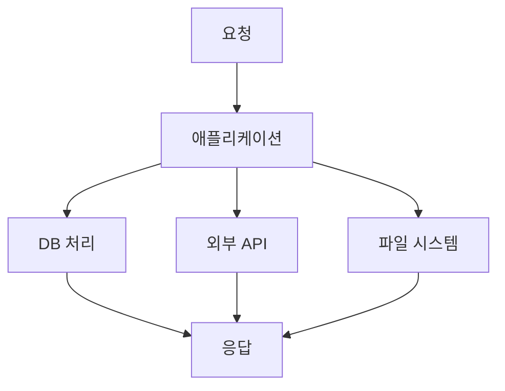
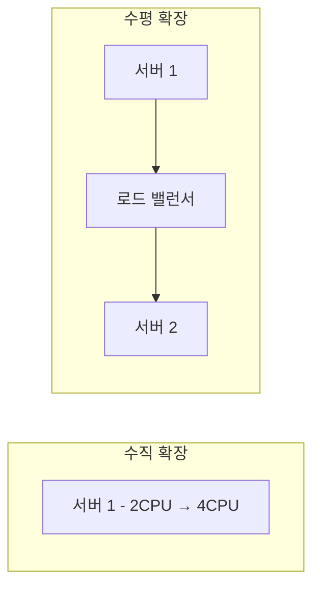
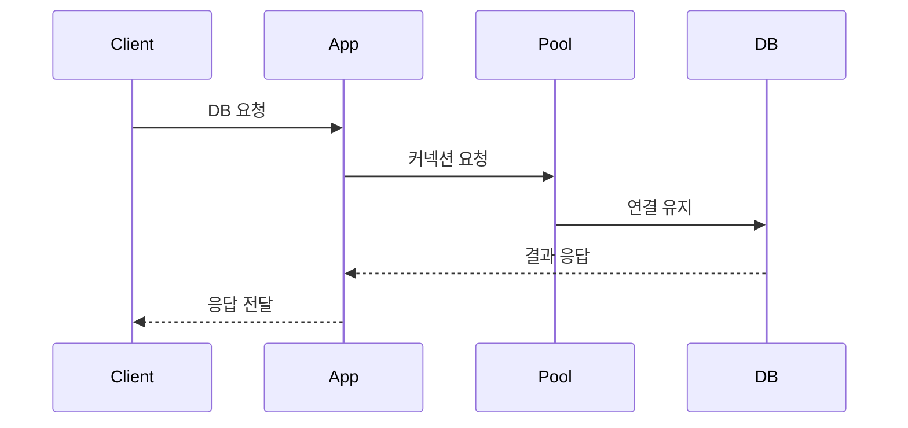
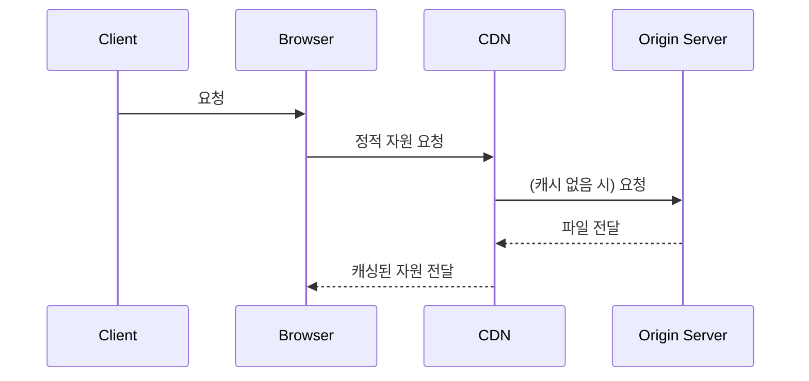
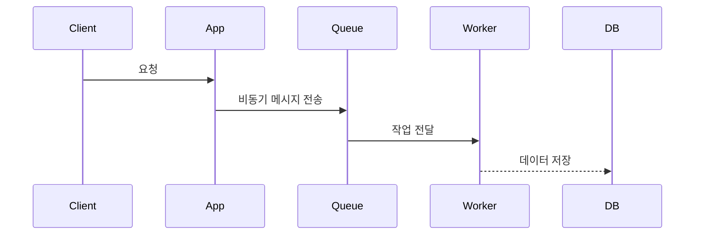

# 주니어 백엔드 개발자가 반드시 알아야 할 실무 지식

- 독서 기간 (2025.06.25 ~ ) / 스터디를 통해 진행
- 목적 : JS 기반으로 알고리즘 공부와 더불어 코딩 테스트 준비

## 목차 요약

- 1장 들어가며
- 2장 느려진 서비스, 어디부터 봐야 할까
- 3장 성능을 좌우하는 DB 설계와 쿼리
- 4장 외부 연동이 문제일 때 살펴봐야 할 것들
- 5장 비동기 연동, 언제 어떻게 써야 할까
- 6장 동시성, 데이터가 꼬이기 전에 잡아야 한다
- 7장 IO 병목, 어떻게 해결하지
- 8장 실무에서 꼭 필요한 보안 지식
- 9장 최소한 알고 있어야 할 서버 지식
- 10장 모르면 답답해지는 네트워크 기초
- 11장 자주 쓰는 서버 구조와 설계 패턴

- 부록 A: 처음 해보는 성능 테스트를 위한 기본 정리
- 부록 B: NoSQL 이해하기
- 부록 C: DB로 분산 잠금 구현하기
- 총 356 Page

## 스터디 진행

- 기간 : 6월 25일 부터 진행 ~ 약 2달 예상
- 날짜 : 매주 수요일, 10시부터 진행할 예정
- 한번 스터디때마다 2명이 발표를 하고, 간단한 퀴즈까지 내주시면 감사합니다. (퀴즈는 필수 아님)
  발표시간은 30분 이내로 하는 것이 적당할 듯 하고, 디스코드에서 진행합니다.
- 발표자 이외의 분들도 책을 읽어오면 좋을 것 같아요 (권장)
- 발표자 2명은 제가 랜덤 순서를 정하겠습니다.
- 요약 : 매주 하루, 2명 발표, 둘이 각각 1장(챕터) 발표
- 특이사항 : 짧은 챕터는 한명이 2장을 발표하겠습니다.

## 1장 & 2장

<details>
  <summary>1장 들어가며</summary>

DB 커넥션을 닫아주지 않아서 문제가 생겼던 적, 커넥션 연결 시간 설정을 제대로 해주지 않아서 문제가 생겼던 적을 예시로 들면서 책이 시작합니다. 모두가 할 수 있는 실수들 이제는 안해도될 실수를 안하기 위해 이 책을 읽게 됐습니다.

</details>

<details>
  <summary>2장 느려진 서비스, 어디부터 봐야 할까</summary>

> 서비스가 느려졌을 때 어디부터 점검해야 하는지를 실무 관점에서 풀어낸 챕터. 다양한 성능 정검 포인트를 미리 알아두면 실무에서도 도움이 될 것 입니다.

## 처리량(Throughput)과 응답 시간(Response Time)

- 처리량: 단위 시간 내에 처리 가능한 요청 수
- 응답 시간: 클라이언트 요청 → 응답 완료까지 걸린 시간


### 처리량

### 응답 시간

## 서버 성능 개선 기초

### 병목 지점(Bottleneck) 파악

**병목의 위치는 어떤 종류가 있을까?**

1. 애플리케이션 로직
2. 데이터베이스
3. 외부 API
4. 네트워크
5. 디스크 I/O



🔍 병목 위치에 따라 접근 방식이 달라진다.

### 수직 확장과 수평 확장

| 구분      | 설명                    | 예시                          |
| --------- | ----------------------- | ----------------------------- |
| 수직 확장 | 서버 스펙을 올림        | CPU, RAM 업그레이드           |
| 수평 확장 | 서버 인스턴스 수를 늘림 | 서버를 여러 대 두고 부하 분산 |



## 커넥션을 관리해보자

- DB와의 연결은 비용이 큼 → 매번 연결/해제 X
- 미리 만들어둔 연결을 재사용
- 커넥션 풀이 없으면? → Too many connections, Connection timeout



**커넥션 풀 튜닝 포인트**

- 크기: 과하면 자원 낭비, 적으면 병목
- 대기 시간: 커넥션이 풀에 없을 때 기다리는 시간
- 최대 유휴 시간: 일정 시간 이상 사용되지 않으면 제거
- 유효성 검사: 커넥션이 죽었는지 확인
- 최대 유지 시간: 커넥션을 너무 오래 쓰지 않도록

### DB 커넥션 풀

### 커넥션 풀 크기

### 커넥션 대기 시간

## 최대 유휴 시간, 유효성 검사, 최대 유지 시간

## 캐시를 활용해보자

**캐시 계층 구조**

```mermaid
graph TD
CLIENT --> LOCAL[로컬 캐시 (메모리)]
LOCAL --> REMOTE[리모트 캐시 (Redis)]
REMOTE --> DB[DB]
```

**캐시 전략**

| 전략             | 설명                                |
| ---------------- | ----------------------------------- |
| 적중률(Hit Rate) | 캐시에서 원하는 데이터를 찾을 확률  |
| 삭제 규칙        | LRU, LFU, TTL 등                    |
| 캐시 사전 적재   | 사용 가능성 높은 데이터를 미리 저장 |
| 캐시 무효화      | DB 변경 시 캐시 동기화 전략 필요    |

### 서버 캐시

### 적중률과 삭제 규칙

### 로컬 캐시와 리모트 캐시

### 캐시 사전 적재

### 캐시 무효화

## 가비지 컬렉터와 메모리 사용

- GC는 예측 불가한 멈춤을 유발 → Full GC는 특히 위험
- 메모리 사용량 분석 필수
  - heap, stack, native, off-heap 등을 구분해 추적
- Java, Node.js 같은 언어는 GC 튜닝이 중요

## 응답 데이터 압축

- gzip, Brotli 압축으로 전송량 줄이기
- 응답 크기 ↓ → 네트워크 시간 ↓

## 정적 자원은 어떻게 효율적으로 보내줄까?

- 이미지, JS, CSS → CDN + 브라우저 캐시 적극 활용
- 정적 파일은 /public, S3, Cloudflare, Fastly 등과 연계



### 정적 자원과 브라우저 캐시

### 정적 자원과 CDN

## 대기 처리 (Queueing)

- 비동기 처리로 사용자 응답 속도 확보
- 메시지 큐(RabbitMQ, Kafka, SQS) 활용



## 요약

- 병목을 찾는 것이 우선이다 (무작정 코드 최적화 X)
- 커넥션, 캐시, 압축, GC 등 다양한 레이어에서 최적화 포인트가 존재
- 시스템 전반을 이해하고, 원인을 추론할 수 있는 실력이 중요

</details>
