# 주니어 백엔드 개발자가 반드시 알아야 할 실무 지식

- 독서 기간 (2025.06.25 ~ ) / 스터디를 통해 진행
- 목적 : JS 기반으로 알고리즘 공부와 더불어 코딩 테스트 준비

## 목차 요약

- 1장 들어가며
- 2장 느려진 서비스, 어디부터 봐야 할까
- 3장 성능을 좌우하는 DB 설계와 쿼리
- 4장 외부 연동이 문제일 때 살펴봐야 할 것들
- 5장 비동기 연동, 언제 어떻게 써야 할까
- 6장 동시성, 데이터가 꼬이기 전에 잡아야 한다
- 7장 IO 병목, 어떻게 해결하지
- 8장 실무에서 꼭 필요한 보안 지식
- 9장 최소한 알고 있어야 할 서버 지식
- 10장 모르면 답답해지는 네트워크 기초
- 11장 자주 쓰는 서버 구조와 설계 패턴

- 부록 A: 처음 해보는 성능 테스트를 위한 기본 정리
- 부록 B: NoSQL 이해하기
- 부록 C: DB로 분산 잠금 구현하기
- 총 356 Page

## 스터디 진행

- 기간 : 6월 25일 부터 진행 ~ 약 2달 예상
- 날짜 : 매주 수요일, 10시부터 진행할 예정
- 한번 스터디때마다 2명이 발표를 하고, 간단한 퀴즈까지 내주시면 감사합니다. (퀴즈는 필수 아님)
  발표시간은 30분 이내로 하는 것이 적당할 듯 하고, 디스코드에서 진행합니다.
- 발표자 이외의 분들도 책을 읽어오면 좋을 것 같아요 (권장)
- 발표자 2명은 제가 랜덤 순서를 정하겠습니다.
- 요약 : 매주 하루, 2명 발표, 둘이 각각 1장(챕터) 발표
- 특이사항 : 짧은 챕터는 한명이 2장을 발표하겠습니다.

## 1장 & 2장

<details>
  <summary>1장 들어가며</summary>

DB 커넥션을 닫아주지 않아서 문제가 생겼던 적, 커넥션 연결 시간 설정을 제대로 해주지 않아서 문제가 생겼던 적을 예시로 들면서 책이 시작합니다. 모두가 할 수 있는 실수들 이제는 안해도될 실수를 안하기 위해 이 책을 읽게 됐습니다.

</details>

<details>
  <summary>2장 느려진 서비스, 어디부터 봐야 할까</summary>

> 서비스가 느려졌을 때 어디부터 점검해야 하는지를 실무 관점에서 풀어낸 챕터. 다양한 성능 정검 포인트를 미리 알아두면 실무에서도 도움이 될 것 입니다.

## 처리량(Throughput)과 응답 시간(Response Time)

- 처리량: 단위 시간 내에 처리 가능한 요청 수
- 응답 시간: 클라이언트 요청 → 응답 완료까지 걸린 시간


### 응답 시간

**TTFB(Time to First Byte)**

> 클라이언트가 요청을 보낸 후, 서버로부터 첫 번째 바이트를 수신할 때까지 걸린 시간

```
[클라이언트 요청] → [서버 수신] → [서버 처리 시작] → [첫 바이트 전송] ← 이 시점까지의 시간
```

- 포함되는 시간
  - 네트워크 왕복 시간(RTT)
  - 서버의 요청 처리 시작 시간
  - 응답 헤더 및 첫 데이터 생성 시간

**📦 TTLB(Time to Last Byte)**

> 클라이언트가 요청을 보낸 후, 서버 응답의 마지막 바이트까지 모두 수신한 시간

```
[요청 시작] → ... → [첫 바이트 수신] → ... → [마지막 바이트 수신] ← 전체 응답 시간
```

- 포함되는 시간

  - TTFB 전체
  - 전체 응답 본문 전송 시간 (payload의 크기, 전송 속도 영향 받음)

- **Bad** TTFB 높음:
  백엔드에서 API 요청 처리에 2초가 걸림 → 첫 바이트가 2초 뒤에 도착

- **Bad** TTLB 높음:
  서버 응답으로 30MB 이미지 데이터를 전송 중 → 마지막 바이트가 도착하는 데 5초

### 처리량

**RPS (Requests Per Second)**

> 1초당 서버가 처리한 HTTP 요청(Request)의 수

예시 상황

- 프론트엔드가 /api/users 요청을 1초에 100번 보내면 → RPS = 100
- 사용자가 웹페이지 접속 시 HTML, CSS, JS 등 여러 개 요청이 발생 → 요청 수가 많아짐

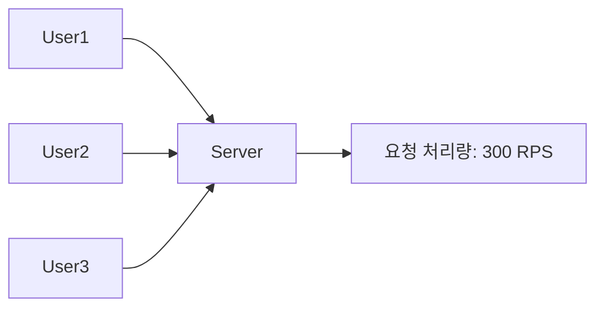

**TPS (Transactions Per Second)**

> 1초당 처리된 트랜잭션(Transaction)의 수

트랜잭션이란?

- 원자적으로 수행되는 연산 단위. 성공하거나, 전부 실패해야 함 (ACID 원칙)
  보통 DB나 금융 시스템에서 많이 쓰임

예시 상황

- 은행 시스템에서 계좌 이체 100건 처리 → TPS = 100
- 게시판에서 게시물 작성, 수정, 삭제 같은 DB 트랜잭션 수행

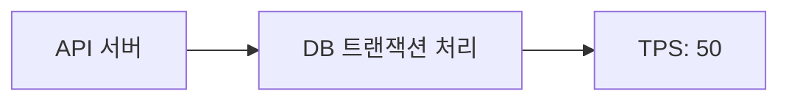

## 서버 성능 개선 기초

초기에는 성능 개선할게 없지만, 트래픽이 늘고 데이터가 많이질수록 개선해야할 사항들이 보입니다.
이떄 어디를 봐야할까요

### 병목 지점(Bottleneck) 파악

**병목의 위치는 어떤 종류가 있을까?**

1. 애플리케이션 로직
2. 데이터베이스
3. 외부 API
4. 네트워크
5. 디스크 I/O

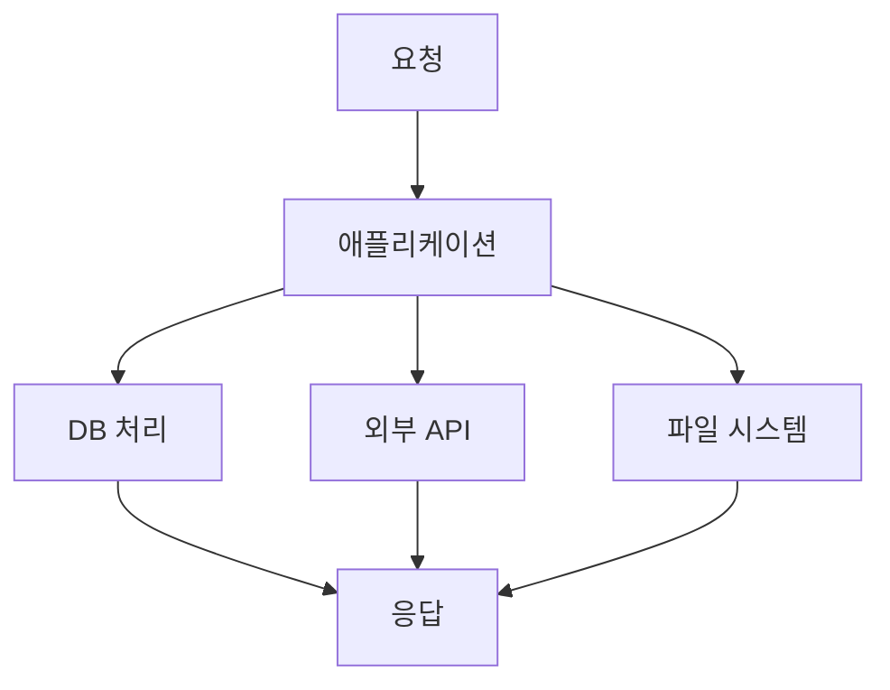

🔍 병목 위치에 따라 접근 방식이 달라진다.

### 수직 확장과 수평 확장

| 구분      | 설명                    | 예시                          |
| --------- | ----------------------- | ----------------------------- |
| 수직 확장 | 서버 스펙을 올림        | CPU, RAM 업그레이드           |
| 수평 확장 | 서버 인스턴스 수를 늘림 | 서버를 여러 대 두고 부하 분산 |

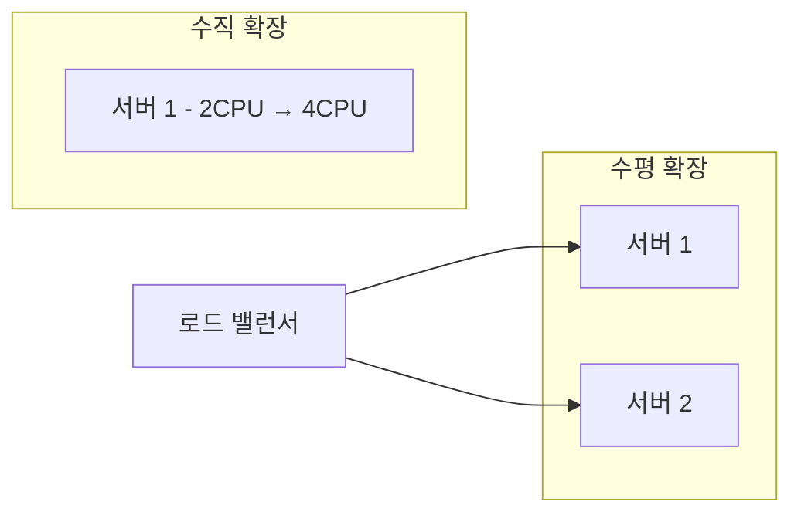

**수직 확장**

특징

- 기존 인프라 구조를 크게 바꾸지 않아도 됨
- 구현이 단순하고 빠름
- 단일 서버 성능을 극대화하는 접근

사용 시점

- 서버 한 대에서 처리하는 로직이 복잡할 때
- DB, 캐시 등 상태 기반 서비스에 적합 (데이터 공유 이슈 있음)
- 시스템이 단순하고 트래픽이 일정 수준 이하일 때

단점

- 확장 한계가 있음 (물리적 한계)
- 비용 대비 효율이 떨어질 수 있음
- 장애 시 리스크가 큼 (SPOF: 단일 장애점)

**수평확장**

특징

- 고가용성, 탄력성 확보에 유리
- 트래픽 증가에 더 유연하게 대응 가능
- 무중단 배포, Blue-Green, Canary 등과도 잘 어울림

사용 시점

- 사용자 수 급증, 트래픽이 많아진 상황
- 웹 서버, API 서버처럼 무상태(Stateless) 서비스
- 클라우드 환경에서 자동 확장을 적용하고 싶을 때

단점

- 아키텍처 복잡도 증가 (로드밸런서, 세션 공유 등 필요)
- 초기 구축 비용과 관리 부담이 있음

## 커넥션을 관리해보자

- DB와의 연결은 비용이 큼 → 매번 연결/해제 X
- 미리 만들어둔 연결을 재사용
- 커넥션 풀이 없으면? → Too many connections, Connection timeout

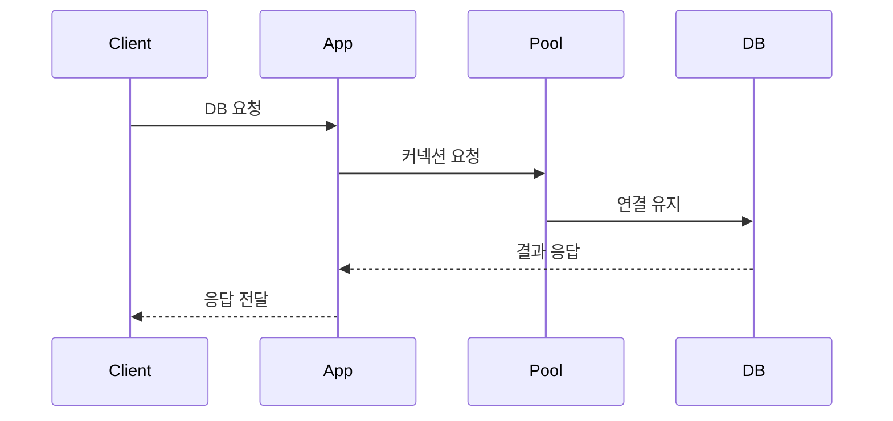

**커넥션 풀 튜닝 포인트**

- 크기: 과하면 자원 낭비, 적으면 병목
- 대기 시간: 커넥션이 풀에 없을 때 기다리는 시간
- 최대 유휴 시간: 일정 시간 이상 사용되지 않으면 제거
- 유효성 검사: 커넥션이 죽었는지 확인
- 최대 유지 시간: 커넥션을 너무 오래 쓰지 않도록

### DB 커넥션 풀

개념

DB와의 연결(Connection)을 미리 여러 개 생성해 풀(Pool)에 저장하고,
요청이 들어올 때마다 이 커넥션을 재사용하는 방식.

왜 필요한가?

- DB 연결은 TCP 핸드셰이크, 인증 등 비용이 큼
- 매 요청마다 커넥션을 생성/해제하면 성능 저하, 커넥션 수 과다 발생

### 커넥션 풀 크기

동시에 유지할 수 있는 DB 커넥션의 최대 수

고려 요소 - 설명

- DB의 max connections: RDS 등에서는 하드 제한 존재
- 서버 수 (App 인스턴스 수): 전체 풀 크기 = 각 인스턴스의 풀 크기 × 인스턴스 수
- 평균 처리 시간: 하나의 커넥션을 점유하는 시간에 따라 다름
- 예상 QPS: 처리량 대비 적절한 커넥션 수 필요

  - 너무 작으면 대기 큐 발생 → 병목
  - 너무 크면 DB 자원 초과 → 장애 발생 가능

### 커넥션 대기 시간

커넥션 풀에 사용 가능한 커넥션이 없을 때, 얼마나 기다릴지 설정하는 시간

API SLA 기준: 응답 보장 시간보다 짧게
사용자 UX 기준: 500ms~1초가 일반적 기준
서버 장애 대비: 무한 대기는 비추천 (적절한 fallback 로직 필요)

대기 시간 초과 시 결과

- 예외 발생 (TimeoutError, AcquireTimeoutError)
- 알람 시스템과 연계하여 이상 징후 탐지 가능

**요약**

- 커넥션 풀 크기 설정 시, 모든 WAS 인스턴스 합산해서 DB의 최대 허용 수 이내로 제한해야 함
- 커넥션 대기 시간은 클라이언트 요청 타임아웃보다 살짝 작게 설정
- 유효성 검사 쿼리(SELECT 1 등) 를 주기적으로 돌려 죽은 커넥션 감지
- 장애 상황 대비, Fallback 처리 로직도 반드시 구성 (e.g. Circuit Breaker)

## 최대 유휴 시간, 유효성 검사, 최대 유지 시간

## 캐시를 활용해보자

**캐시 계층 구조**

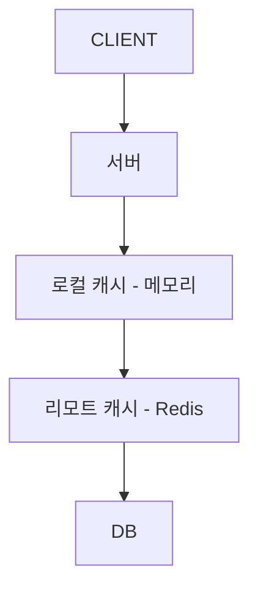

**캐시 전략**

| 전략             | 설명                                |
| ---------------- | ----------------------------------- |
| 적중률(Hit Rate) | 캐시에서 원하는 데이터를 찾을 확률  |
| 삭제 규칙        | LRU, LFU, TTL 등                    |
| 캐시 사전 적재   | 사용 가능성 높은 데이터를 미리 저장 |
| 캐시 무효화      | DB 변경 시 캐시 동기화 전략 필요    |

### 서버 캐시

> 서버 측에서 자주 요청되는 데이터나 계산 결과를 임시 저장하여 반복되는 요청에 대해 빠르게 응답할 수 있도록 하는 전략

적용 위치

- DB 조회 결과
- 연산 비용이 큰 API 응답
- 외부 API 호출 결과
- HTML SSR 결과 (예: Next.js getStaticProps)

장점

- DB/서버 부하 감소
- 응답 속도 향상
- 비용 절감 (외부 API 호출 최소화 등)

### 적중률과 삭제 규칙

캐시 적중률 (Cache Hit Ratio): 전체 요청 중 캐시를 통해 응답된 비율

- 높을수록 성능 효율 우수
- 낮으면 캐시 전략이 잘못된 것

삭제(만료) 규칙 – Eviction Policy

- LRU (Least Recently Used): 가장 오래 사용되지 않은 항목 삭제
- LFU (Least Frequently Used): 가장 적게 사용된 항목 삭제
- FIFO: 먼저 들어온 항목부터 삭제
- TTL (Time To Live): 저장된 후 일정 시간이 지나면 삭제

### 로컬 캐시 vs 리모트 캐시

| 항목         | 로컬 캐시 (Local)                      | 리모트 캐시 (Remote)          |
| ------------ | -------------------------------------- | ----------------------------- |
| 저장 위치    | 애플리케이션 메모리                    | 별도 캐시 서버 (Redis 등)     |
| 접근 속도    | 매우 빠름 (ms 이내)                    | 네트워크 따라 다름            |
| 데이터 공유  | 불가능 (서버 간 공유 불가)             | 가능 (여러 서버 간 공유 가능) |
| 장애 시 영향 | 앱 프로세스 죽으면 캐시 유실           | 고가용성 구성 가능            |
| 사용 예시    | 짧은 TTL의 데이터, Config, 사용자 설정 | 사용자 세션, 대량 조회 결과   |

### 캐시 사전 적재

정의

자주 쓰이는 데이터를 미리 캐시에 넣어두는 작업

사용 시점

- 서비스 시작 시 (Warm-up)
- 정기적으로 인기 데이터 업데이트
- 대규모 트래픽 이전 (예: 이벤트 직전)

장점

- Cold Start 이슈 방지
- 초기 사용자 경험 개선

### 캐시 무효화 (Cache Invalidation)

**정의**  
캐시에 저장된 데이터가 더 이상 유효하지 않을 때 **제거하거나 갱신**하는 과정

| 전략                         | 설명                                                    | 사용 예시                        |
| ---------------------------- | ------------------------------------------------------- | -------------------------------- |
| TTL 기반 만료                | 일정 시간이 지나면 자동으로 삭제                        | 뉴스, 상품 정보 등               |
| 수동 무효화                  | API 호출 또는 데이터 변경 시 직접 삭제                  | 게시글 수정 후 `del(post:${id})` |
| 버전 기반 무효화             | key에 버전 정보를 포함해 새 버전 요청 시 이전 캐시 무시 | `post:v1:id=123`                 |
| Write-through / Write-behind | DB 변경 시 캐시를 동기화하는 패턴                       | Redis와 RDB 조합                 |

## 가비지 컬렉터와 메모리 사용

- GC는 예측 불가한 멈춤을 유발 → Full GC는 특히 위험
- 메모리 사용량 분석 필수
  - heap, stack, native, off-heap 등을 구분해 추적
- Java, Node.js 같은 언어는 GC 튜닝이 중요

## 응답 데이터 압축

- gzip, Brotli 압축으로 전송량 줄이기
- 응답 크기 ↓ → 네트워크 시간 ↓

## 정적 자원은 어떻게 효율적으로 보내줄까?

- 이미지, JS, CSS → CDN + 브라우저 캐시 적극 활용
- 정적 파일은 /public, S3, Cloudflare, Fastly 등과 연계

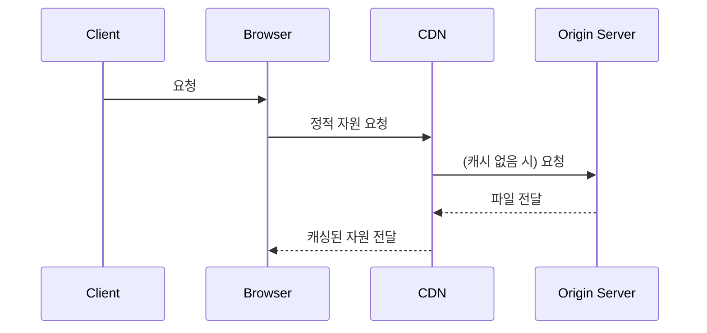

### 정적 자원과 브라우저 캐시

### 정적 자원과 CDN

## 대기 처리 (Queueing)

- 비동기 처리로 사용자 응답 속도 확보
- 메시지 큐(RabbitMQ, Kafka, SQS) 활용

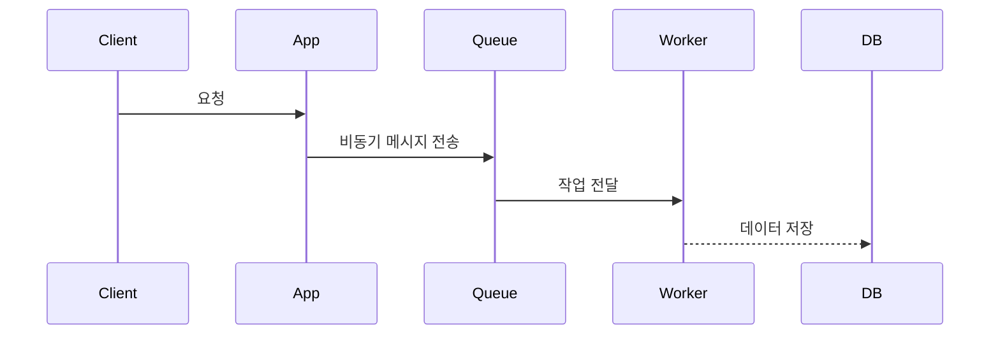

## 요약

- 병목을 찾는 것이 우선이다 (무작정 코드 최적화 X)
- 커넥션, 캐시, 압축, GC 등 다양한 레이어에서 최적화 포인트가 존재
- 시스템 전반을 이해하고, 원인을 추론할 수 있는 실력이 중요

</details>

<!-- <details> -->
  <summary>6장 동시성, 데이터가 꼬이기 전에 잡아야 한다</summary>

## 동시성이란?

> 동시성이란, 여러 작업이나 프로세스가 동시에 실행되는 것처럼 보이는 것을 의미합니다. 컴퓨터 과학에서는 여러 작업이 동시에 진행되는 것처럼 보이게 하는 기법을 말하며, 실제로는 CPU가 빠르게 번갈아 가며 작업을 처리합니다.

### 서버와 동시 실행

트래픽이 낮아도 요청은 많을 수 있다. 그러니까 미리 준비해두는 것이 중요하다.

**동시에 여러 요청을 처리하는 방법**

- 요청마다 스레드 할당
- 비동기 IO, 논블로킹 IO 사용해서 처리

```java
public class Incrementer {
  private int count = 0;

  public void increment() {
    count++;
  }

  public int getCount() {
    return count;
  }
}
```

위의 코드는 동시성 문제가 발생할 수 있다.
다중 스레드 환경에서 두 스레드가 동시에 count를 증가시키려고 하면 예상치 못한 결과가 발생할 수 있다.

<!-- 한쪽에는 thread1, 다른 한쪽에는 thread2가 있다. 둘다 동시에 실행된다. count 값을 구하고 그 값을 증가시킨다. 그리고 그결과를 반영한다. -->

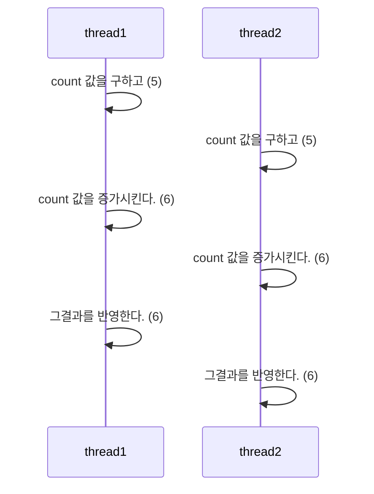

> race condition: 두 스레드가 동시에 같은 데이터를 수정하려고 할 때 발생하는 문제

## 잘못된 데이터 공유로 인한 문제 에시

```java
public class PaymentService {
  private Long paymentId;

  public PayResp pay(PayReq req) {
    this.paymentId = req.getPaymentId();
    saveTemp(this.paymentId, req);
    PayResp resp = savePayData(this.paymentId, ...);
    applyResponse(resp);
    return resp;
  }

  private void saveTemp(Long paymentId, PayReq req) {
    // 임시 저장
  }

  private PayResp savePayData(Long paymentId, PayReq req) {
    // 결제 데이터 저장
  }

  private void applyResponse(PayResp resp) {
    PayData payData = createPayDataFromResp(resp);
    updatePayData(this.paymentId, payData);
  }

  private PayData createPayDataFromResp(PayResp resp) {
    // 결제 데이터 생성
  }

  private void updatePayData(Long paymentId, PayData payData) {
    // 결제 데이터 업데이트
  }
}
```

위의 코드도 paymentId 값이 공유되는 문제가 있다.

> 동시성은 간헐적으로 발생하는 경우가 많다. 그렇기 때문에 문제를 찾기가 어렵다.

## 프로세스 수준에서의 동시 접근 제어

**Lock을 사용해서 동시성 문제를 해결할 수 있다.**

공유 자원에 대한 접근하는 스레드를 하나로 제한하는 것

1. 공유 자원에 대한 접근을 제한한다.
2. 접근 제한 후 작업을 수행한다. (임계 영역)
3. 작업이 완료되면 접근 제한을 해제한다.

> 임계 영역: 공유 자원에 대한 접근을 제한한 영역 (둘 이상의 스레드가 동시에 접근할 수 없는 영역)

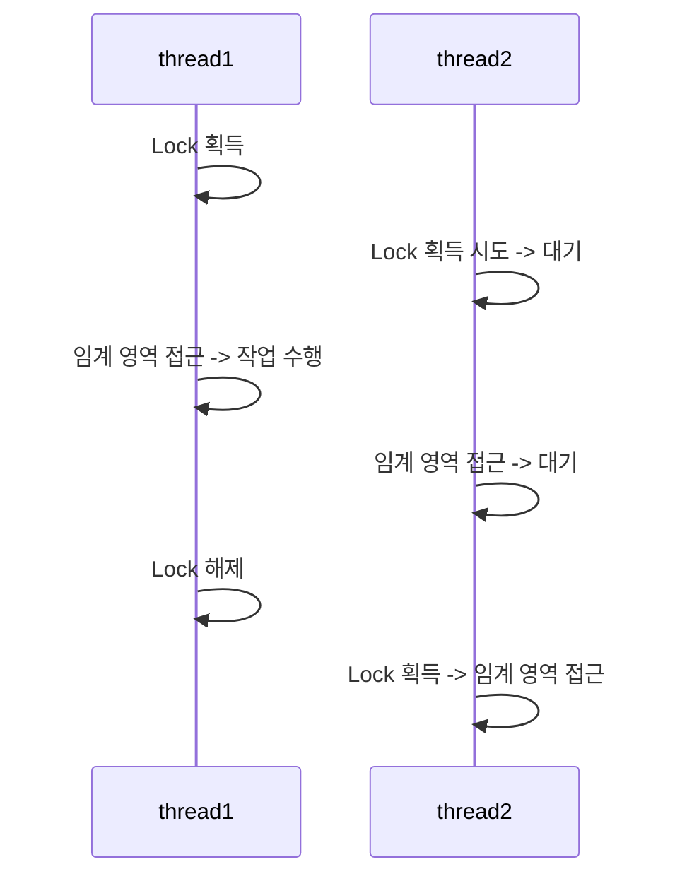

> 락을 획득한 스레드만 임계 영역에 접근할 수 있다.

구현 방법은 "synchronized" 키워드 또는 "ReentrantLock" 클래스를 사용한다.

```java
public class PaymentService {
    private Long paymentId; // 공유 자원

    private final Object lock = new Object();

    public void processPayment(PayReq req) {
        synchronized (lock) {
            paymentId = req.getPaymentId();
            saveTemp(paymentId, req);
            savePayData(paymentId, req);
            applyResponse(paymentId);
        }
    }

    private void saveTemp(Long paymentId, PayReq req) {
        // 임시 저장
    }

    private void savePayData(Long paymentId, PayReq req) {
        // 결제 데이터 저장
    }

    private void applyResponse(Long paymentId) {
        // 응답 적용
    }
}
```

> 뮤텍스(Mutex): 임계 영역을 보호하는 기본적인 동기화 메커니즘 (Mutual Exclusion), 한국어로는 상호 배제라고 한다. Lock으로 부르기도 한다.

### 세마포어

> 동시에 접근할 수 있는 스레드의 개수를 제한하는 기본적인 동기화 메커니즘

자바에서는 세마포어 구현체를 퍼밋(Permit) 이라고 부른다.

동작 방식은 아래와 같다.

1. 세마포어에서 퍼밋을 획득한다. (허용가능한 스레드 -1)
2. 임계 영역에 접근한다.
3. 임계 영역을 벗어나면 퍼밋을 반납한다. (허용가능한 스레드 +1)

```java
public class PaymentService {
  private final Semaphore semaphore = new Semaphore(5); // 허용가능한 스레드 개수

  public void processPayment(PayReq req) {
    try {
      semaphore.acquire();
    } catch (InterruptedException e) {
      // 예외 처리
    }

    try {
      // 임계 영역 -> 최대 5개의 스레드만 접근 가능
    } finally {
      semaphore.release();
    }
  }
}
```

**읽기 쓰기 잠금**

> 읽기 작업은 동시에 여러 스레드가 접근할 수 있지만, 쓰기 작업은 하나의 스레드만 접근할 수 있도록 제한하는 기본적인 동기화 메커니즘

```java
public class PaymentService {
  private final ReadWriteLock lock = new ReentrantReadWriteLock();

  public void processPayment(PayReq req) {
    lock.readLock().lock();
    try {
      // 읽기 작업 -> 동시에 여러 스레드가 접근 가능
    } finally {
      lock.readLock().unlock();
    }
  }

  public void processPayment(PayReq req) {
    lock.writeLock().lock();
    try {
      // 쓰기 작업 -> 하나의 스레드만 접근 가능
    } finally {
      lock.writeLock().unlock();
    }
  }
}
```

### 원자적타입 (Atomic Type)

> 원자적 타입은 하나의 작업으로 처리되는 타입을 의미한다.

```java
public class PaymentService {
  private int count = 0;

  public void increment() {
    count++;
  }
}
```

위의 코드는 동시성 문제가 발생할 수 있다. 왜냐하면 count 값을 증가시키는 작업이 여러 스레드에서 동시에 실행될 수 있기 때문이다.

```java
public class PaymentService {
  private int count = 0;
  private Lock lock = new ReentrantLock();

  public void increment() {
    lock.lock();
    try {
      count++;
    } finally {
      lock.unlock();
    }
  }
}
```

위의 코드는 동시성 문제는 없지만, CPU 효율이 떨어진다.

> 원자적 타입은 하나의 작업으로 처리되는 타입을 의미한다.

```java
public class PaymentService {
  private AtomicInteger count = new AtomicInteger(0);

  public void increment() {
    count.incrementAndGet();
  }
}
```

AtomicInteger 클래스는 원자적 작업을 수행하는 클래스이다. 내부적으로 동기화를 처리하기 때문에 동시성 문제가 발생하지 않는다. (CAS 알고리즘)

> CAS 알고리즘: 비교 후 교체 알고리즘, 원자적 작업을 수행하는 알고리즘

    1.	메모리의 값이 내가 기대한 값인지 확인(Compare)
    2.	같으면 새 값으로 교체(Swap)
    3.	다르면 아무것도 안 하고 다시 시도

“값이 내가 생각한 상태일 때만 교체하고, 아니면 다시 시도하는 알고리즘”

```text
function CAS(memory_address, expected_value, new_value):
    if *memory_address == expected_value:
        *memory_address = new_value
        return true
    else:
        return false
```

### 동시성 지원 컬렉션

> 동시성 지원 컬렉션은 동시성 문제를 해결하기 위한 컬렉션 클래스를 의미한다.

```java
public class PaymentService {
  private Map<Long, PayData> payDataMap = new ConcurrentHashMap<>(); // 동시성 지원 컬렉션
  // 안좋은 예시
  // private Map<Long, PayData> payDataMap = new HashMap<>();

  public void processPayment(PayReq req) {
    payDataMap.put(req.getPaymentId(), req); // 동시성 문제 없음
  }
}
```

### DB와 동시성

**트랜지션**

> 트랜지션은 데이터베이스 작업의 단위를 의미한다.

**트랜지션으로 얻는 이점**

- 데이터 일관성 보장
- 데이터 무결성 보장
- 데이터 정합성 보장

**비관적과 낙관적 잠금**

- 비관적 잠금: 데이터를 읽거나 쓰기 전에 잠금을 획득하는 방식 -> 실패 가능성이 높아서 비관적
- 낙관적 잠금: 데이터를 읽거나 쓰기 전에 잠금을 획득하지 않고, 작업을 수행한 후 잠금을 획득하는 방식 -> 실패 가능성이 낮아서 낙관적

### 선점 잠금 (비관적 잠금)

> 먼저 접근한 놈이 잠금을 획득한다.

```sql
select * from 테이블 where 조건 for update;
```

테이블에서, 조건에 맞는 데이터를 읽고, 잠금을 획득한다.

예시: 게시글을 읽으려는 사용자가 있고, 게시글을 수정하려는 사용자가 있다.

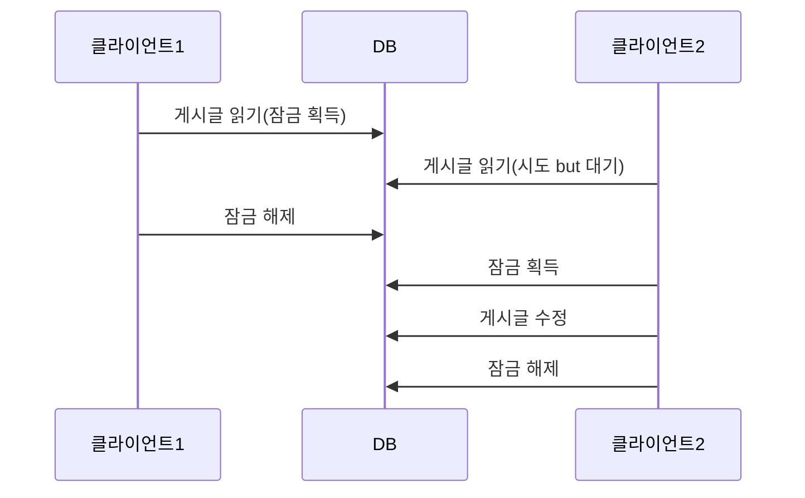

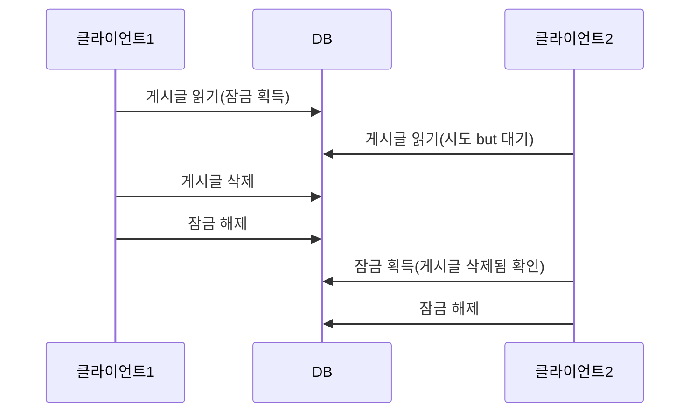

### 비선점 (낙관적 잠금)

> 데이터 충돌은 드물다고 가정하고 먼저 처리, 나중에 검증

**개념 요약**

- 비관적 잠금(Pessimistic Lock)은 **먼저 락 걸고** 작업
- 낙관적 잠금(Optimistic Lock)은 **먼저 작업하고** 나중에 충돌 체크
- 충돌 시 **실패하거나 재시도**

**동작 원리**

1. 데이터를 조회
2. 조회 시점의 버전(version) 또는 타임스탬프(timestamp) 기록
3. 데이터를 수정 후, 업데이트할 때 버전도 함께 비교
4. 버전이 같으면 업데이트 → 버전 +1
5. 버전이 다르면 충돌 감지 → 실패 or 재시도

**장점**

- 락으로 인한 병목 없이 성능 향상

**단점**

- 충돌이 잦은 환경에서는 실패/재시도 증가 → 성능 저하
- 실시간성이 중요한 시스템에는 부적합

```sql
-- 데이터 조회
select * from posts where id = 1; -- 버전 0 (버전을 함께 조회)

-- 데이터 수정
update posts set title = 'new title', version = version + 1 where id = 1 and version = 0; -- 버전 1 (버전을 함께 수정)

-- 데이터 조회
select * from posts where id = 1; -- 버전 1 (버전을 함께 조회)

-- 데이터 수정
update posts set title = 'new title', version = version + 1 where id = 1 and version = 0; -- 버전 2 (버전을 함께 수정)
```

```java
import jakarta.persistence.OptimisticLockException;
import org.springframework.stereotype.Service;
import org.springframework.transaction.annotation.Transactional;

@Service
public class PostService {
    private final PostRepository postRepository;

    public PostService(PostRepository postRepository) {
        this.postRepository = postRepository;
    }

    @Transactional
    public void updatePost(Long id, String newContent) {
        Post post = postRepository.findById(id)
            .orElseThrow(() -> new RuntimeException("Post not found"));

        post.setContent(newContent);

        // ✅ 커밋 시점에 version 비교 -> JPA에서 제공하는 기능
        // 다른 트랜잭션에서 version 변경했으면 OptimisticLockException 발생
    }

    @Transactional
    public Post getPost(Long id) {
        return postRepository.findById(id)
            .orElseThrow(() -> new RuntimeException("Post not found"));
    }
}
```

### 잠금 사용 시 주의사항

- 잠근 해제하기: 잠금을 획득한 후 해제하지 않으면 다른 스레드가 대기할 수 있다.
- 대기 시간 최소화: 대기 시간을 최소화하여 UX 문제를 줄인다.

## 교착 상태(Deadlock) 피하기

> **“교착 상태란 둘 이상의 프로세스가 서로 자원을 점유한 채 영원히 대기하는 상태”**  
> 동시성 프로그래밍에서 매우 위험한 상황으로, 시스템 전체가 멈출 수 있다.

### 교착 상태란?

**정의**

- 두 개 이상의 스레드/프로세스가 서로가 점유한 **락(Lock)이나 자원(Resource)** 을 기다리며 무한 대기하는 상태
- 자원을 서로 양보하지 않아서 발생

### 교착 상태 발생 조건 (Coffman’s Four Conditions)

1. **상호 배제(Mutual Exclusion)**

   - 한 번에 하나의 프로세스만 자원 사용 가능

2. **점유와 대기(Hold and Wait)**

   - 자원을 점유한 상태에서 다른 자원을 기다림

3. **비선점(No Preemption)**

   - 점유한 자원을 강제로 빼앗을 수 없음

4. **대기 사이클(Circular Wait)**
   - 프로세스들이 서로 자원을 점유하고 다음 자원을 요청하는 원형 대기 발생

> 4가지 조건이 모두 만족할 때 교착 상태 발생 가능

### 예제: 두 개의 락으로 발생하는 Deadlock

```java
public class DeadlockExample {
    private final Object lock1 = new Object();
    private final Object lock2 = new Object();

    public void task1() {
        synchronized (lock1) {
            System.out.println("Task1: lock1 획득");
            synchronized (lock2) {
                System.out.println("Task1: lock2 획득");
            }
        }
    }

    public void task2() {
        synchronized (lock2) {
            System.out.println("Task2: lock2 획득");
            synchronized (lock1) {
                System.out.println("Task2: lock1 획득");
            }
        }
    }
}
```

> 기아 상태: 대기 중인 스레드가 없는 상태

### 교착 상태 해결 방법

- 잠금 순서 고정
- 잠금 범위 최소화
- 잠금 해제 시점 조정
- 잠금 대기 시간 제한

## 단일 스레드로 처리하기

> **“동시성 문제? 그냥 단일 스레드로 해결하면 된다!”**  
> 모든 요청을 하나의 스레드에서 순차 처리하면 공유 자원 접근 문제를 원천 차단할 수 있다.

### 단일 스레드 처리란?

- 한 번에 하나의 요청만 처리하는 방식
- 여러 스레드가 동시에 실행되지 않음 → **락(lock)**, **동기화(synchronization)** 필요 없음
- 이벤트 루프(Event Loop)나 큐(queue)를 통해 요청을 순차적으로 처리

### 장점

| 항목             | 설명                                     |
| ---------------- | ---------------------------------------- |
| 동시성 문제 없음 | 데이터 경합(race condition), 교착 상태 X |
| 락 불필요        | 락으로 인한 병목, 오버헤드 제거          |
| 구현 단순화      | 복잡한 동기화 코드 제거                  |

### 단점

| 항목           | 설명                                     |
| -------------- | ---------------------------------------- |
| 처리 속도 제한 | 요청을 병렬 처리하지 못함                |
| CPU 활용 저조  | 멀티코어 시스템에서 단일 코어만 사용     |
| 긴 작업 대기   | 하나의 작업이 오래 걸리면 다음 요청 지연 |

---

## 🧠 동작 방식

### 이벤트 루프 모델

1. 요청을 큐에 넣음
2. 이벤트 루프가 하나씩 꺼내 처리
3. 처리 완료 후 다음 요청 처리

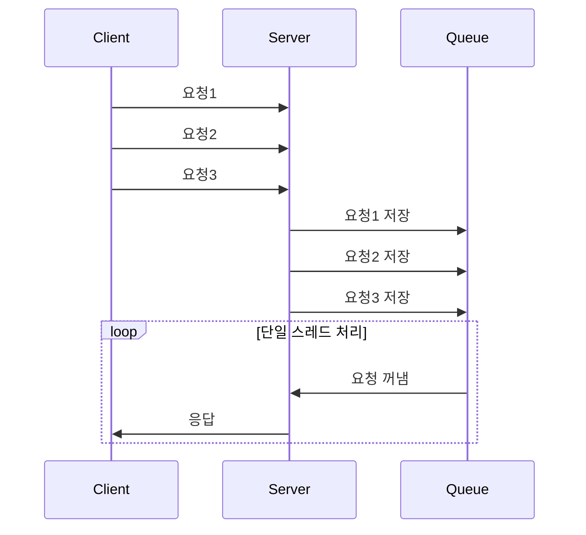
