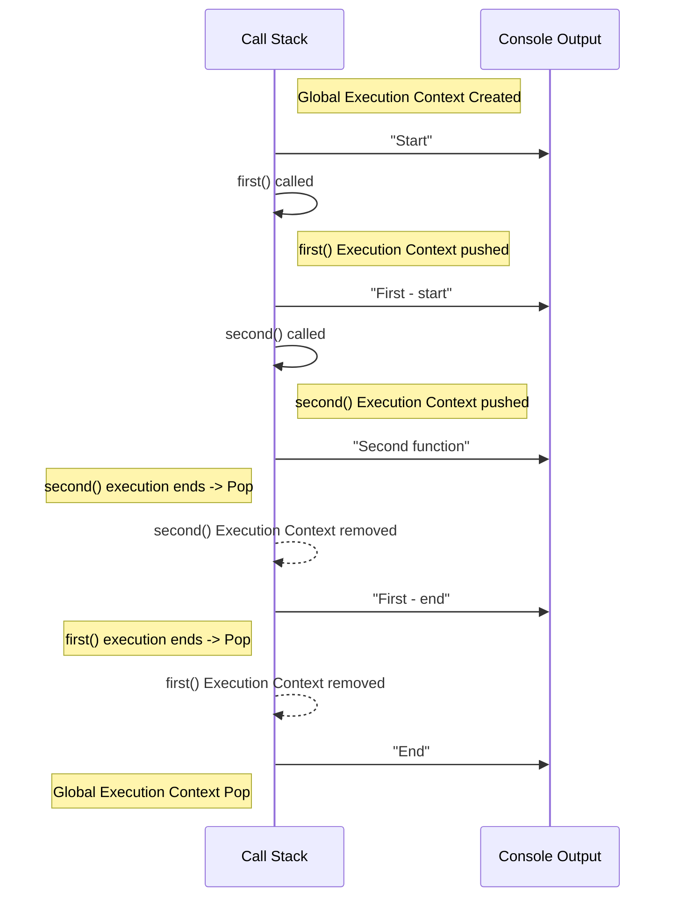
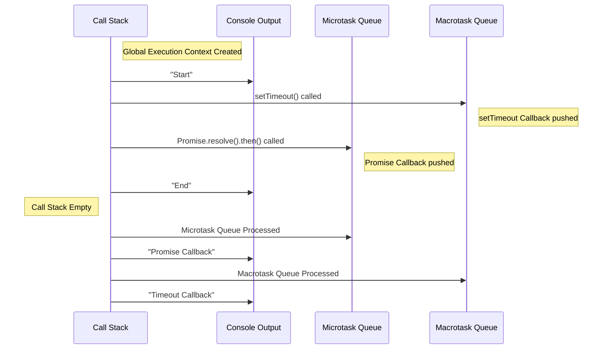

# 1. JavaScript Deep Dive (JS 심화 학습)

미리 알아두어야 할 점: 자바스크립트는 싱글 스레드 언어이다. 이 말은 자바스크립트는 한 번에 하나의 작업만 수행할 수 있다는 것을 의미한다. 브라우저에서 자바스크립트 코드를 실행할 때, 자바스크립트 엔진을 통해 실행된다. 대표적으로 V8 엔진이 있다.

## 1.1. Execution Context & Call Stack

자바스크립트 코드는 실행 컨텍스트(Execution Context)에서 실행된다. 실행 컨텍스트는 코드가 실행되는 환경을 말한다.

실행 컨텍스트는 2개의 단계로 나뉜다.

1. **Creation Phase**: 실행 컨텍스트가 생성되고 변수, 함수 등의 정보가 저장된다.
2. **Execution Phase**: 코드가 실행되며 변수에 값이 할당되고 함수가 호출된다.

조금 더 자세히 알아보자.

### 1.1.1. Creation Phase (생성 단계)

- 1. 스코프/환경정보 설정 (Lexical Environment & Variable Environment 구성)
     자바스크립트 엔진은 함수 내부에 선언된 변수와 함수를 먼저 스캔한다. 이 과정에서 함수 선언문은 함수 객체로 미리 생성되고, 변수는 메모리에 등록(선언)만 되어 초기값은 undefined로 설정된다. 이 과정을 흔히 “호이스팅(hoisting)”이라고 부른다.

     > - `var` : 환경 레코드(Environment Record)에 **초기값 `undefined`로 할당**된 후 실행 단계에서 값을 변경함.

     > - `let`, `const` : **초기화되지 않은 상태로 메모리에 등록되며, 실행 전에 접근하면 ReferenceError 발생** (TDZ, Temporal Dead Zone).

     > 함수 선언문은 함수 객체로 미리 생성되어 스코프 체인에 추가되지만, 함수 표현식은 변수에 할당되기 전까지 접근할 수 없다. 따라서 함수 표현식은 호이스팅되지 않는 것처럼 동작한다. (함수 선언문과 함수 표현식의 차이)

     ```javascript
     // 함수 선언문은 호이스팅되어 함수 객체가 먼저 생성된다.
     // 따라서 아래 코드는 정상적으로 실행된다.
     foo(); // foo

     // 함수 표현식은 변수에 할당되기 전까지 접근할 수 없다.
     // 따라서 아래 코드는 ReferenceError가 발생한다.
     bar(); // ReferenceError: Cannot access 'bar' before initialization

     // 함수 선언문
     function foo() {
       console.log("foo");
     }

     // 함수 표현식
     var bar = function () {
       console.log("bar");
     };
     ```

- 2. 외부 환경(Outer Environment Reference) 결정
     현재 실행 중인 함수가 어떤 스코프 체인(Chain) 을 바탕으로 변수 참조를 할 것인지가 결정된다. 즉, 이 함수가 어디서 정의되었는지에 따라 상위 스코프가 설정된다.

- 3. this 바인딩 결정
     브라우저에서 함수가 일반 호출되면 this는 전역 객체(window 등)나 undefined(strict 모드)로 바인딩된다. 메서드로 호출되면 해당 메서드의 주체 객체가 this가 되는 식이다. 이 바인딩 정보가 실행 컨텍스트에 포함된다.

### 1.1.2. Execution Phase (실행 단계)

- 실제 코드 실행
  생성 단계가 끝난 후, 코드를 위에서 아래로 한 줄씩 실행한다. 미리 “선언”만 되어 있던 변수가 실질적인 값으로 초기화되고, 함수 호출이 일어나면 그에 따른 실행 컨텍스트가 새롭게 만들어진다.

- 변수 할당, 연산 수행, 함수 호출
  스코프 체인, this 바인딩을 참조해 필요한 값을 찾고, 연산을 수행한 뒤 변수에 대입한다. 함수가 종료되면 컨텍스트는 스택에서 빠져나간다.

**실행 컨텍스트는 크게 2가지 종류로 나뉜다.**

- global 실행 컨텍스트: JavaScript 스크립트가 처음 실행될 때 생성되며 JavaScript의 global 범위를 나타냅니다.
- function 실행 컨텍스트는 함수가 호출될 때마다 생성되며 함수의 local 범위를 나타냅니다.

스크립트가 실행되면 Global(전역) 실행컨텍스트가 생성되고, 함수가 호출되면 함수 실행컨텍스트가 생성된다 그리고 이는 call stack 최상단에 push 됩니다. 함수 실행컨텍스트는 함수가 실행되는 동안 유지되며, 함수 실행이 끝나면 제거된다. 함수 실행컨텍스트가 제거되면 call stack에서 pop 된다. (LIFO)

```javascript
console.log("Start");

function first() {
  console.log("First - start");
  second();
  console.log("First - end");
}

function second() {
  console.log("Second function");
}

first();
console.log("End");
```

위 코드를 실행하면, 아래와 같은 순서로 출력된다.

```
Start
First - start
Second function
First - end
End
```



위 코드의 실행 과정을 간단한

- 1단계: 전역 컨텍스트가 생성되어 호출 스택에 들어가고, console.log("Start")가 실행되어 "Start"를 출력합니다.
- 2단계: first() 함수가 호출되면 first의 실행 컨텍스트가 생성되어 스택 최상단에 push됩니다. 이제 스택에는 전역 컨텍스트 아래에 first 컨텍스트가 존재합니다.
- 3단계: first 함수 내부에서 "First - start"를 출력한 뒤, second() 함수를 호출합니다. second 함수의 실행 컨텍스트가 생성되어 호출 스택 최상단에 추가됩니다.
- 4단계: second 함수에서 "Second function"을 출력하고 반환(return)되면서 second 컨텍스트를 호출 스택에서 pop합니다. 실행 흐름은 다시 first 함수로 돌아옵니다.
- 5단계: first 함수의 나머지 코드가 실행되어 "First - end"를 출력한 뒤 함수 실행이 끝나면, first 컨텍스트도 스택에서 제거됩니다.
- 6단계: 호출 스택에 다시 전역 컨텍스트만 남은 상태로 console.log("End")가 실행되어 "End"를 출력합니다. 전역 코드 실행이 모두 끝나면 전역 컨텍스트도 pop되어 스택이 비게 됩니다.

위 과정에서 보듯이 전역 컨텍스트 → first 컨텍스트 → second 컨텍스트 순으로 스택에 쌓였다가 역순으로 제거되며, 호출 스택을 통해 함수들의 진입 및 복귀 순서가 관리됩니다. 이러한 메커니즘 덕분에 자바스크립트는 함수 호출의 흐름을 추적하고, 함수 종료 후 원래 위치로 되돌아갈 수 있습니다. 단일 호출 스택을 사용하기 때문에 한 번에 하나의 함수만 실행되며, 다른 작업은 현재 실행이 완료될 때까지 대기하게 됩니다.

    실습 팁: 크롬 브라우저의 개발자 도구에서 Debugger를 이용하면 코드 실행 중 호출 스택의 변화를 실시간으로 관찰할 수 있습니다. 브레이크포인트를 설정한 뒤 함수 호출을 따라가 보면, 함수 진입 시마다 스택에 추가되고 종료 시 제거되는 모습을 확인할 수 있습니다.

[참고 링크](https://dev.to/jahid6597/javascript-execution-context-a-deep-dive-4kno)

[참고 링크](https://www.freecodecamp.org/news/how-javascript-works-behind-the-scene-javascript-execution-context/)

## 1.2. Lexical Scope & Closure

Lexical 뜻: 사전적인, 문법적인

자바스크립트는 렉시컬 스코프(Lexical Scope), 즉 정적 스코프 규칙을 따르며, 이는 함수가 선언된 위치에 따라 스코프(변수의 유효 범위)가 결정됨을 의미합니다. 함수가 자신의 내부에 또 다른 함수를 정의하면, 내부 함수는 **스코프 체인(scope chain)** 을 통해 자신이 정의된 환경(상위 함수 혹은 전역 스코프)의 변수들에 접근할 수 있습니다. 이러한 구조에서 탄생하는 개념이 **클로저(Closure)** 입니다.

> 클로저란 “어떤 함수와 그 함수가 선언될 당시의 렉시컬 환경의 조합”으로, 함수가 자기 외부 스코프에 있는 상태를 기억하여 유지하는 기능을 가리킵니다.

간단히 말해, 내부 함수가 외부 함수의 변수에 접근하는 상황을 허용하여, 외부 함수 실행이 끝난 후에도 변수가 사라지지 않고 계속 유지되도록 만드는 것이 클로저입니다. 실제로 자바스크립트에서는 함수가 생성될 때마다 그 렉시컬 환경을 함께 저장하며, 이로 인해 클로저가 자연스럽게 구현됩니다.

클로저의 특성은 다양한 활용을 가능케 합니다. 특히 데이터 은닉과 상태 유지에 유용한데, 클로저를 사용하면 외부에서 직접 접근 불가능한 private 변수를 만들 수 있고, 해당 변수는 내부 함수에 의해 접근 및 변경만 허용됩니다. 또한 클로저는 고차 함수(Higher-order function)나 부분 적용 함수(currying) 등을 구현할 때도 활용되며, 이처럼 함수가 생성된 환경을 기억하는 능력 덕분에 팩토리 함수 패턴 등에서 유연한 코드 작성이 가능합니다.

클로저 특성:

1. 데이터 은닉: 외부에서 직접 접근 불가능한 private 변수 생성
2. 상태 유지: 함수 실행이 끝나도 변수가 사라지지 않고 유지

다음은 클로저의 개념을 보여주는 간단한 예시입니다. 외부 함수 createCounter 안에 정의된 내부 함수가 외부 변수 count를 참조하여, 호출될 때마다 count를 증가시키고 반환합니다:

```javascript
function createCounter() {
  let count = 0; // 외부 함수의 지역 변수 (은닉되고 유지되는 값)
  return function () {
    // 내부 함수 - 클로저를 형성
    count += 1;
    return count;
  };
}

const counter = createCounter(); // counter는 내부 함수를 가리키는 클로저
console.log(counter()); // 출력: 1  (count가 0에서 1로 증가)
console.log(counter()); // 출력: 2  (count가 이전 호출 이후로 유지되어 1에서 2로 증가)
```

createCounter 함수가 호출되고 실행을 마치면 원래대로라면 count 변수는 소멸해야 합니다. 그러나 createCounter가 반환한 내부 함수가 count를 참조하고 있기 때문에 count는 garbage collection의 대상이 되지 않고 그 값이 유지됩니다. counter()를 호출할 때마다 동일한 count 변수에 접근하여 값을 증가시키고, 그 결과를 반환하게 됩니다. 이처럼 클로저를 이용하면 함수 실행이 끝나도 변수가 사라지지 않고 기억되므로, 호출될 때마다 상태를 유지하는 stateful한 함수를 만들 수 있습니다.

위 예시에서 count는 외부에서는 직접 접근할 수 없는 프라이빗 변수로서 동작합니다. 오직 반환된 내부 함수(counter)를 통해서만 간접적으로 접근 및 변경이 가능하므로, 의도치 않은 조작으로부터 데이터를 보호(은닉)할 수 있습니다. 이러한 클로저를 활용한 모듈 패턴을 이용하면, 전역 변수를 사용하지 않고도 상태를 유지하는 기능을 구현할 수 있어 코드의 캡슐화에 큰 도움이 됩니다.

또 다른 예시 cache 함수는 인자로 받은 함수를 래핑하여, 한 번 계산된 결과를 캐싱하여 다음 호출 시에는 캐시된 값을 반환합니다. 이를 통해 중복 계산을 피하고 성능을 향상시킬 수 있습니다.

```javascript
function cache(func) {
  const cached = {}; // 캐시 저장 객체
  return function (arg) {
    // 인자를 받는 내부 함수
    if (cached[arg] === undefined) {
      // 캐시된 값이 없으면
      cached[arg] = func(arg); // 새로 계산하여 캐시에 저장
    }
    return cached[arg]; // 캐시된 값 반환
  };
}

function factorial(n) {
  if (n === 0) return 1;
  return n * factorial(n - 1);
}

const cachedFactorial = cache(factorial); // factorial 함수를 래핑한 캐시 함수
console.log(cachedFactorial(5)); // 출력: 120  (처음 호출 시 계산)

console.log(cachedFactorial(5)); // 출력: 120  (이후 호출 시 캐시된 값 반환)
```

[참고 링크](https://developer.mozilla.org/ko/docs/Web/JavaScript/Closures)

[참고 링크](https://www.geekster.in/articles/closure-in-javascript)

## 1.3. Event Loop & Asynchronous JavaScript

자바스크립트 엔진은 **단일 스레드(single-thread)** 로 동작하여 한 번에 하나의 작업만 처리할 수 있습니다. 그렇다면 시간이 오래 걸리는 작업을 실행하는 동안 다른 작업은 모두 중단될까요? 이를 방지하기 위해 자바스크립트 환경(브라우저나 Node.js)은 **이벤트 루프(Event Loop)** 와 각종 **비동기 API(Web APIs)** 를 활용하여 논블로킹(non-blocking) 방식으로 동작합니다. 자바스크립트 코드 자체는 한 줄씩 순차적으로 실행되지만, 타이머 설정이나 HTTP 요청 같은 작업은 엔진을 블로킹하지 않고 별도의 큐(queue)에 콜백을 등록해 놓은 뒤, 나중에 적절한 시점에 실행되도록 합니다.

이벤트 루프는 자바스크립트의 실행 모델 핵심으로, **콜 스택(Call Stack)** 과 **태스크 큐(Task Queue)** 를 관리하며 동작합니다. 일반적인 흐름은 다음과 같습니다:

1. 콜 스택에 현재 실행 중인 동기 코드가 있으면 그 작업을 계속 처리합니다.
2. 콜 스택이 비게 되면, 이벤트 루프는 대기 중인 태스크 큐에서 실행 가능한 작업을 가져와 콜 스택에 넣고 실행합니다.
3. 한 번의 루프(iteration)가 끝난 후에도 처리할 대기 작업(이벤트)이 있으면 1번 단계부터 다시 반복합니다. 더 이상 실행할 태스크가 없으면 다음 이벤트 발생을 기다리며 대기하게 됩니다.

여기서 **태스크 큐(Task Queue)** 는 **매크로태스크 큐(Macrotask Queue)** 라고도 부르며, 타이머 콜백(setTimeout, setInterval), UI 이벤트 콜백, AJAX 응답 등의 비동기 작업 콜백들이 대기하는 곳입니다. 또한 ES6부터 도입된 Promise의 후속 처리(.then 콜백)나 MutationObserver의 콜백 등은 별도의 **마이크로태스크 큐(Microtask Queue)** 에 대기합니다. 마이크로태스크는 매크로태스크에 비해 더 높은 우선순위를 가지며, 이벤트 루프는 매번 콜 스택이 비워질 때마다 우선 마이크로태스크 큐의 모든 작업을 실행한 후 매크로태스크를 처리합니다. 즉, 마이크로태스크 > 매크로태스크 순서로 실행된다고 이해할 수 있습니다. (마이크로태스크 큐 처리 중 새 마이크로태스크가 추가되면, 추가된 것까지 모두 처리한 후에야 매크로태스크로 넘어갑니다.)

예시: microtask와 macrotask의 우선순위

```javascript
console.log("Start");

setTimeout(() => {
  console.log("Timeout Callback");
}, 0);

Promise.resolve().then(() => {
  console.log("Promise Callback");
});

console.log("End");
```

위 코드를 실행하면, 아래와 같은 순서로 출력됩니다.

```
Start
End
Promise Callback
Timeout Callback
```

위 코드를 실행하면 콘솔에 찍히는 순서는 어떻게 될까요? (setTimeout 콜백의 지연 시간을 0으로 설정했지만, 이 콜백도 매크로태스크 큐에 들어가기 때문에 즉시 실행되지 않습니다.)

1. 동기 코드가 우선 실행됩니다. "Start"가 출력되고, 곧바로 setTimeout이 호출되지만 콜백은 나중을 위해 태스크 큐로 보내집니다. 그 다음 Promise.resolve().then(...)이 실행되는데, then의 콜백은 마이크로태스크 큐에 등록됩니다. 이어서 "End"가 출력됩니다. 이 시점까지 콜 스택에 있던 코드는 모두 실행되어 콜 스택이 빈 상태가 됩니다.
2. 콜 스택이 비었으므로 이벤트 루프가 큐를 확인합니다. 마이크로태스크 큐에 Promise의 .then 콜백이 대기 중이므로 이를 가장 먼저 실행합니다. 따라서 "Promise Callback"이 출력됩니다.
3. 마이크로태스크 큐를 모두 비우면, 이벤트 루프는 매크로태스크 큐(태스크 큐)에 있던 setTimeout 콜백을 가져와 실행합니다. 이 단계에서 "Timeout Callback"이 출력됩니다.

위 결과를 통해, 자바스크립트 엔진은 동기 코드를 모두 실행한 뒤 비동기 콜백들을 처리하는데, **Promise의 후속 처리(.then)** 처럼 마이크로태스크로 등록된 작업이 setTimeout과 같은 매크로태스크보다 먼저 실행됨을 알 수 있습니다. 결국 "Promise Callback"이 "Timeout Callback"보다 앞서 출력되는 것은 이러한 이벤트 루프 우선순위 규칙 때문입니다.



우선순위 규칙:

1. 콜 스택이 비어있을 때, 마이크로태스크 큐에 있는 모든 작업을 처리합니다.

2. 마이크로태스크 큐가 모두 비어있으면, 매크로태스크 큐에 있는 작업을 처리합니다.

3. 매크로태스크 큐에 있는 작업이 모두 처리되면, 이벤트 루프는 다시 콜 스택이 비어있을 때까지 대기합니다.

## 1.4. JavaScript memory management & Garbage Collection

자바스크립트는 개발자가 직접 메모리를 할당하거나 해제하지 않아도 되는 자동 메모리 관리(garbage collected language) 언어입니다. 즉, **필요 없어진 메모리를 가비지 컬렉터(Garbage Collector)** 가 알아서 해제해줍니다.

하지만 어떤 경우에 메모리가 해제되는지 이해하고, 효율적인 메모리 사용을 위한 패턴을 아는 것이 중요합니다.

### 메모리 할당과 해제

변수를 선언하거나 객체를 생성하면 자바스크립트 엔진은 필요한 메모리를 할당합니다. 기본 자료형(숫자, 문자열 등)은 보통 스택(stack) 또는 힙(heap)에 값이 저장되고, 객체나 배열 등 복합 자료형은 힙에 할당되며 변수는 그 **참조(reference)** 를 갖습니다. 엔진은 주기적으로 가비지 컬렉션을 수행하여 **도달 불가능(unreachable)** 해진 값들을 메모리에서 해제합니다.

가장 널리 쓰이는 알고리즘은 **Mark-and-Sweep (표시-스위프)** 으로, 자바스크립트 엔진들은 대체로 이 방법을 기반으로 동작합니다.

> Mark-and-Sweep의 기본 개념은 **“더 이상 필요하지 않은 객체란, 프로그램에서 도달할 수 없는 객체”** 로 정의하는 것입니다.

가비지 컬렉터는 우선 전역 객체(window 등)와 같이 **루트(root)**가 되는 객체들을 찾고, 루트가 참조하고 있는 객체들, 또 그 객체들이 참조하는 객체들… 이런 식으로 연결된 객체들을 모두 **마크(mark)**합니다.

이렇게 마크된 객체들은 여전히 필요하다고 간주되고, 나머지 마크되지 않은 객체들은 다른 어디에서도 참조되지 않는 도달 불가능한 객체로 판단하여 메모리에서 스위프(sweep), 즉 해제합니다.

이 방식을 통해 순환 참조(서로가 서로를 참조하는 두 객체)처럼 참조 횟수만으로는 판별할 수 없는 메모리 누수 상황도 제대로 수거할 수 있습니다. (모든 최신 브라우저 엔진은 Mark-and-Sweep을 기반으로 동작하며, 여기에 세대별 수집(generational GC), 증분 수집(incremental GC), 병렬 수집(parallel GC) 등의 최적화를 부가하여 성능을 향상시킵니다.)

### 흔한 메모리 누수의 원인과 방지 방법

자동으로 메모리를 관리해주지만, 개발자의 코드 구조에 따라 불필요한 객체가 참조되어 메모리에서 해제되지 않는, 이른바 **메모리 누수(memory leak)** 가 발생할 수 있습니다. 주로 다음과 같은 상황에서 메모리 누수가 일어날 수 있으므로 주의를 기울여야 합니다:

- 전역 변수의 남용: 전역 변수는 애플리케이션이 종료될 때까지 메모리에 남아 있습니다. 예를 들어 개발 편의를 위해 데이터를 window 객체의 프로퍼티로 저장하거나(global 객체에 attach) 하면, 해당 참조를 지우지 않는 한 가비지 컬렉터가 수거하지 못합니다. 필요한 경우가 아니라면 변수 범위를 가능한 좁게 유지하고, 전역 네임스페이스 오염을 피하는 것이 좋습니다. (즉, `globalVar = {...}`로 선언하기보다는 함수나 블록 스코프 내 let/const를 활용하세요.)

```javascript
// 전역 변수로 선언한 데이터
window.globalData = { ... };

// 필요 없어진 경우에는 참조를 제거해야 함
window.globalData = null;

// let과 const를 사용하여 스코프를 제한하는 것이 좋음
function doSomething() {
  let localData = { ... };
  // ...
}

// 블록 스코프 내에서 선언한 변수는 블록을 벗어나면 자동으로 해제됨
{
  const blockData = { ... };
  // ...
}
```

- 이벤트 리스너를 해제하지 않은 경우: DOM 엘리먼트에 추가한 이벤트 리스너는 해당 엘리먼트를 참조로 잡고 있기 때문에, 엘리먼트가 더 이상 화면에 없어도(예: removeChild로 제거) 리스너가 남아 있다면 메모리가 해제되지 않습니다. 따라서 동적으로 추가한 이벤트 리스너는 필요 없을 때 removeEventListener를 호출하여 제거하거나, 혹은 SPA(single-page application)에서 화면전환 시 불필요해진 리스너를 정리하는 로직이 필요합니다. 비슷하게, pub-sub 패턴의 이벤트 emitter를 사용할 때도 구독을 해지하지 않으면 메모리 누수가 발생할 수 있습니다.

```javascript
// React에서의 이벤트 리스너 해제 예시
const MyComponent = () => {
  useEffect(() => {
    const handleClick = () => { ... };
    document.addEventListener("click", handleClick);
    return () => {
      document.removeEventListener("click", handleClick);
    };
  }, []);
  return <div>My Component</div>;
};
```

- 타이머나 인터벌을 해제하지 않은 경우: setInterval로 등록한 주기적 작업은 clearInterval을 호출하기 전까지 계속 유지되므로 콜백이 참조하는 객체들도 해제되지 않고 남아 있게 됩니다 . 필요 없는 타이머는 반드시 해제하여 참조를 끊어주어야 합니다. setTimeout의 콜백도 실행 전까지 큐에 머물러 있으므로, 특정 상황에서는 clearTimeout으로 취소하는 것이 도움이 됩니다.

```javascript
// 타이머 해제 예시
const timerId = setInterval(() => { ... }, 1000);
// 필요 없어진 경우에는 해제
clearInterval(timerId);
```

- 클로저를 통한 참조 유지: 앞서 언급한 클로저는 유용하면서도 잘못 사용하면 메모리 누수를 만들 수 있습니다. 외부 함수 실행이 끝난 후에도, 불필요해진 값이 클로저에 의해 참조되면 가비지 컬렉터가 수거하지 못합니다 . 예를 들어 거대한 배열이나 객체를 클로저로 잡아놓고 더 이상 사용하지 않는다면 그것은 메모리 낭비입니다. 따라서 클로저를 사용할 때는 진짜 필요한 변수만 캡처하고, 필요 없어지면 의도적으로 참조를 끊어주는 것이 좋습니다. (예: 클로저 내부에서 더 이상 필요 없는 객체를 null로 설정)

```javascript
function createLeak() {
  const largeArray = new Array(1000000).fill("leak");
  return function () {
    console.log(largeArray.length);
  };
}

const leakFunc = createLeak();
// leakFunc을 더 이상 사용하지 않으면 largeArray는 클로저에 묶여 해제되지 않음
```

위 코드에서 largeArray는 createLeak 실행이 끝난 후에도 leakFunc 클로저에 의해 참조가 유지되므로, leakFunc 참조를 제거하거나 더 이상 사용하지 않으면 (예를 들어 leakFunc = null로 설정) 가비지 컬렉터가 수거할 수 있도록 해야 합니다.

### 메모리 누수 방지 및 관리 기법:

- WeakMap/WeakSet 활용: WeakMap과 WeakSet은 객체를 키(또는 값)로 저장하되 가비지 컬렉터가 해당 객체를 대상으로 인식할 수 있도록 약한 참조(weak reference)를 사용하는 컬렉션입니다.

WeakMap의 키로 저장된 객체는 다른 곳에서 참조되지 않으면 가비지 컬렉션 대상이 되며, 해당 키-값 쌍도 자동으로 제거됩니다. 이는 캐시나 조회용으로 객체를 맵에 저장할 때 유용하며, 이 구조를 사용하면 일일이 메모리를 정리하지 않아도 알아서 사라지므로 메모리 누수를 예방할 수 있습니다.

다만 WeakMap/WeakSet은 이 특성상 이터러블이 아니며 저장된 객체를 열거할 수 없다는 점에 유의하세요.

```javascript
const cache = new WeakMap();
function cacheValue(obj, value) {
  cache.set(obj, value);
}
function getCachedValue(obj) {
  return cache.get(obj);
}
```

위의 코드는 WeakMap을 사용하여 객체에 값을 캐싱하는 예시입니다. cacheValue로 값을 저장하고 getCachedValue로 값을 조회할 수 있으며, 이때 cache에 저장된 객체가 더 이상 필요 없어지면 가비지 컬렉터가 알아서 처리합니다.

- 불필요한 참조 해제: 변수나 객체 프로퍼티가 더 이상 필요 없게 되면 delete 연산자나 null 할당 등을 통해 참조를 제거하는 것이 좋습니다. 특히 전역 객체나 싱글톤 객체에 붙여둔 프로퍼티가 있다면 적절한 시점에 정리하세요.

- 개발자 도구 활용: 브라우저의 메모리 프로파일러(예: 크롬 개발자도구의 Memory 탭)로 힙 스냅샷을 찍어 누수가 있는지 확인하거나, Performance 탭에서 GC 횟수와 메모리 사용량 변화를 관찰할 수 있습니다. 이를 통해 의심 코드의 메모리 사용 패턴을 분석하고, 누수가 있다면 어떤 객체가 계속 남아있는지 추적할 수 있습니다.

  요약: 자바스크립트의 가비지 컬렉터는 자동으로 메모리를 관리해주지만, 개발자의 코드 패턴에 따라 메모리 누수가 발생할 수 있음을 항상 염두에 두어야 합니다. 특히 전역적이나 장시간 유지되는 객체의 관리에 신경 쓰고, 이벤트 리스너나 타이머, 클로저 등이 불필요한 참조를 유지하지 않도록 구조를 설계하세요. 필요하면 WeakMap 등의 도구를 활용하여 참조를 약하게 유지하고, 객체가 가비지 컬렉션될 수 있게 하세요. 이러한 메모리 관리 최적화는 큰 규모 애플리케이션에서 성능과 안정성을 높이는 데 중요한 역할을 합니다.
